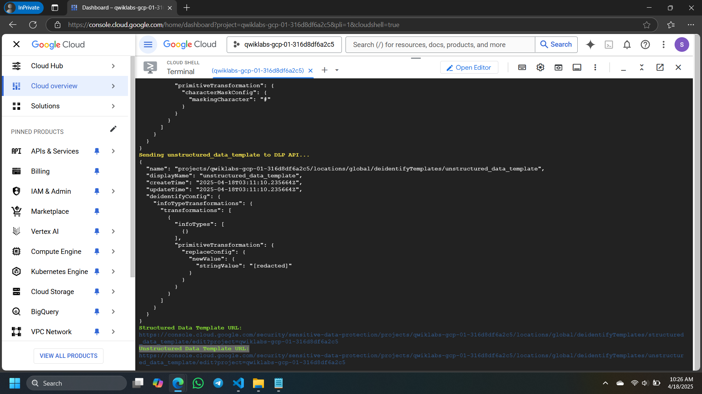

# Get Started with Sensitive Data Protection: Challenge Lab || [ARC116](https://www.cloudskillsboost.google/focuses/64782?parent=catalog) ||

### Run the following Commands in CloudShell

```
curl -LO raw.githubusercontent.com/Get_Started_with_Sensitive_Data_Protection_Challenge_Lab/arc116-1.sh

sudo chmod +x arc116-1.sh

./arc116-1.sh
```

click link Structured Data Template URL and Unstructured Data Template URL


Follow these step:

1. click ADD TRANSFORMATION RULE
   - Field(s) or column(s) to transform: message
   - Transformation type: Match on infoType
2. click ADD TRANSFORMATION:
   - Transformation: Replace with infoType name
   - InfoTypes to transform: Any detected infoTypes defined in an inspection template or inspect config that are not specified in other rules
3. SAVE
   
4. Expand Transformation rule
   - InfoTypes to transform: Any detected infoTypes defined in an inspection template or inspect config that are not specified in other rules
     

### Run again the following Commands in CloudShell

```
curl -LO raw.githubusercontent.com/Get_Started_with_Sensitive_Data_Protection_Challenge_Lab/arc116-2.sh

sudo chmod +x arc116-2.sh

./arc116-2.sh
```

### Congratulations 🎉 for Completing the Lab!

#### Outstanding work! Your commitment has made this accomplishment possible.

#### Don't Forget to Join the [Telegram Channel](https://t.me/quickgcplab) & [Discussion Group](https://t.me/quickgcplabchats).

# [QUICK GCP LAB](https://www.youtube.com/@quickgcplab)
